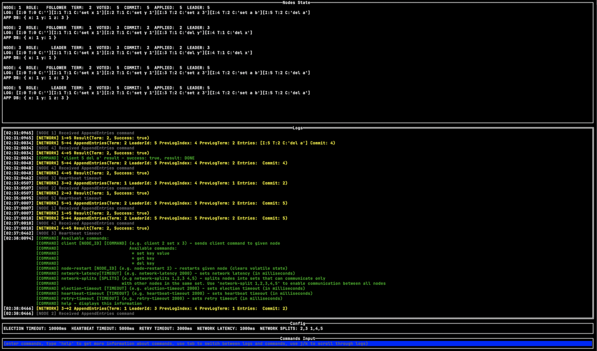

# Raft Playground

Implementation of simple key-value distributed database which uses [Raft](https://raft.github.io/raft.pdf) consensus algorithm, 
with some terminal UI to play around with it. I created this project to learn Go and build a better understanding of Raft algorithm.

If you want to run this project, just clone this repository and execute `go run src/main.go` (tested and built using `go1.19.2`).

